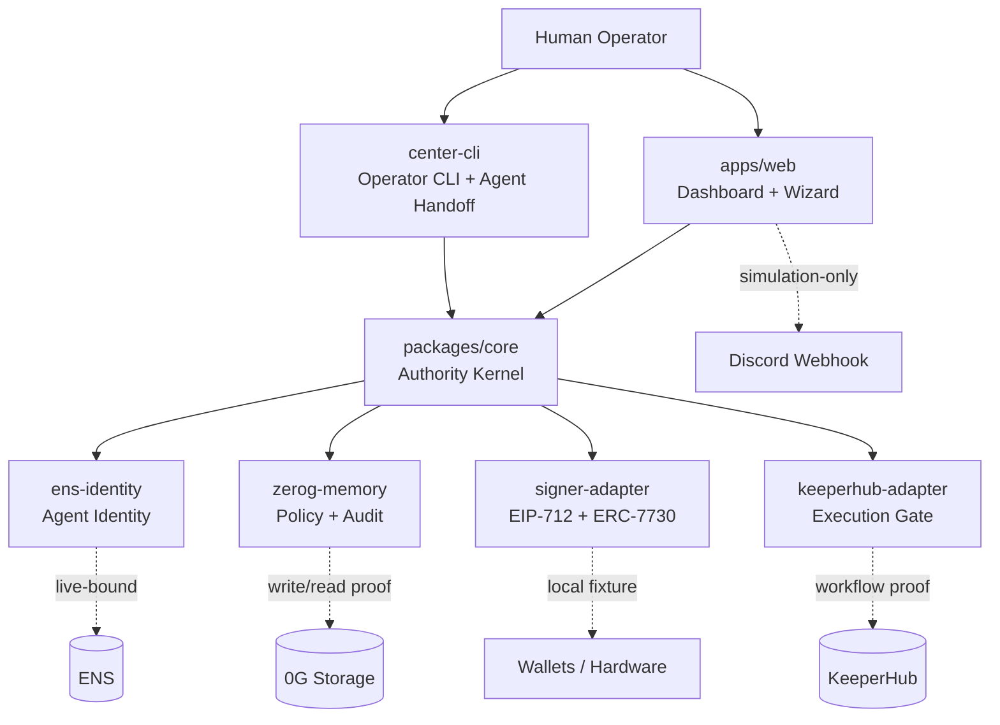
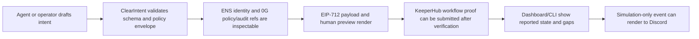

# ClearIntent

ClearIntent is an authority layer for autonomous AI agents: a TypeScript framework that turns agent intents into verifiable, scoped, signable actions on EVM chains.

Current evidence: local contract/core tests pass; ENS identity is live-bound; 0G policy and audit storage has live write/read proof; KeeperHub has workflow-execution proof; EIP-712 and ERC-7730 signing surfaces are locally fixture-proven; the Phase 6 authority dashboard foundation and Phase 7 setup/custody wizard have recorded evidence; Phase 8 established SDK/CLI handoffs and repo-local agent skills for driving intents into structured, auditable workflows.

ClearIntent's submission posture is intentionally evidence-bound: the project proves the authority envelope, provider evidence flow, setup/custody journey, and demo notification rendering. Transaction-backed autonomous execution remains an explicit near-term gap until a real transaction hash and receipt are recorded.

## Capability Snapshot

| Capability | Today | Near goal |
| --- | --- | --- |
| Intent schema + authority kernel | `local-fixture` / local tests over canonical contracts | testnet-integrated verification |
| Agent identity | `ens-live-bound` for `guardian.agent.clearintent.eth` | user-scoped agent subnames such as `<username>.agent.clearintent.eth` |
| Policy and audit memory | `0g-write-read-verified` plus ENS-bound 0G artifacts | richer audit bundles and optional encrypted/private modes |
| Execution adapter | `keeperhub-live-submitted` workflow proof, no transaction hash | transaction-backed KeeperHub receipt |
| Signer adapter | EIP-712 typed data and ERC-7730 metadata fixtures | real wallet prompt evidence, then WalletConnect/hardware matrices |
| Dashboard | Phase 6 authority dashboard foundation | live provider reads and trusted KeeperHub event checks |
| Setup/custody wizard | Phase 7 evidence for parent wallet, agent smart account, 0G policy, ENS payload, KeeperHub run | one transaction-backed test intent through the agent account path |
| SDK/CLI handoff | `clearintent` executable shim, local operator setup, agent context, intent create/evaluate/submit/execute | public npm package release |
| Agent workflow skills | repo-local ClearIntent skills for intent authoring, execution gates, escalation, transaction running, and audit | reusable agent framework example |
| Demo notifications | simulation-only Discord webhook forwarding for rendered ClearIntent events | authenticated, replay-checked event fanout |

## Install

```bash
git clone https://github.com/Vel-Labs/ClearIntent
cd ClearIntent
npm install
npm test
```

Run the full local quality gate:

```bash
npm run check
```

## Quick Start

Run the interactive operator center:

```bash
npm run clearintent
```

Create and evaluate a local bounded intent:

```bash
npm run clearintent -- intent create --template safe-test-transfer
npm run clearintent -- intent evaluate
```

After `npm install`, the local package bin is also available from the checkout:

```bash
npx --no-install clearintent setup local-operator
npx --no-install clearintent agent context
npx --no-install clearintent intent create --template safe-test-transfer
```

The root package is now publish-ready from the repo side, but it has not been published to npm. Until a public npm release exists, use `npm run clearintent` or `npx --no-install clearintent` from a local checkout.

## How It Works

ClearIntent has two complementary layers.

**Authority architecture**



**Current proven path**



**Full intended lifecycle**

```mermaid
flowchart LR
    A[Agent proposes action] --> B[Resolve identity via ENS]
    B --> C[Load policy from 0G]
    C --> D[Build bounded EIP-712 intent]
    D --> E[Human review or scoped policy approval]
    E --> F[Wallet signs typed payload]
    F --> G[Verify signature, policy, nonce, deadline, executor, bounds]
    G --> H[KeeperHub or executor submits transaction]
    H --> I[Receipt and audit bundle write to 0G]
    I --> J[ENS / agent card points to latest audit state]
```



The second diagram is the product lifecycle target. The current submission does not claim transaction-backed execution until `H` has a real transaction hash and receipt evidence.

## Provider Usage

ClearIntent used sponsor/provider products as implementation surfaces, not as branding wrappers.

| Provider | How ClearIntent used it | Evidence boundary |
| --- | --- | --- |
| ENS | Live agent identity and text-record binding for 0G policy, policy hash, audit pointer, agent card, and ClearIntent version. | `ens-live-bound`; identity discovery is not approval. |
| 0G | Live Storage write/read/proof path for policy and audit artifacts, later bound through ENS records. | `0g-write-read-verified`; optional 0G Compute remains deferred. |
| KeeperHub | Workflow execution adapter and live workflow/run proof after ClearIntent verification gates. | `keeperhub-live-submitted`; no transaction hash yet. |
| Alchemy Account Kit | Dashboard/wizard path for parent-owned agent smart account setup on Sepolia. | setup/custody evidence; no session-key enforcement claim. |
| EIP-712 / ERC-7730 wallet standards | Canonical typed intent payload and local clear-signing metadata generation. | local fixture proof; wallet-rendered preview remains pending. |
| Discord webhooks | Demo-only rendering of ClearIntent event outcomes to a configured operator webhook. | simulation-only notification; not approval or execution evidence. |

## Packages

| Package | Purpose | Current claim |
| --- | --- | --- |
| `packages/core` | Contract-backed authority kernel: lifecycle, hashing, validation, fail-closed verification. | local authority kernel |
| `packages/center-cli` | Human CLI and AI-readable JSON operator surface, plus SDK-style handoff commands. | shipped locally |
| `packages/zerog-memory` | 0G policy/audit artifact adapter and live binding helpers. | `0g-write-read-verified` |
| `packages/ens-identity` | ENS agent identity resolver and text-record binding helpers. | `ens-live-bound` |
| `packages/keeperhub-adapter` | KeeperHub workflow execution adapter and receipt conversion boundary. | `keeperhub-live-submitted` |
| `packages/signer-adapter` | EIP-712 typed payloads, readable preview, ERC-7730 metadata, injected-wallet request shape. | local fixture |
| `apps/web` | Authority dashboard, setup/custody wizard, provider evidence views, simulation-only event rendering. | local dashboard/wizard evidence |

Each package/app has a local README with usage, provider fit, and claim boundaries.

## CLI Commands

The Center CLI exposes human-readable output by default and deterministic JSON with `--json`.

| Group | Commands |
| --- | --- |
| Setup | `setup local-operator`, `agent context` |
| Intent | `intent create`, `intent evaluate`, `intent submit`, `intent execute`, `intent validate`, `intent state` |
| Authority | `authority evaluate` |
| Center | `center status`, `center inspect` |
| Identity | `identity status`, `identity live-status`, `identity bind-records`, `identity send-bind-records` |
| Memory | `memory status`, `memory check`, `memory audit-bundle`, `memory live-status`, `memory live-smoke`, `memory live-bindings` |
| Execution | `execution status`, `keeperhub status`, `keeperhub live-status`, `keeperhub live-submit`, `keeperhub live-run-status` |
| Signer | `signer status`, `signer preview`, `signer typed-data`, `signer metadata` |
| Safety | `credentials status`, `test local`, `module list`, `module doctor` |

For machine consumers through npm, use:

```bash
npm run --silent clearintent -- agent context --json
```

## Hackathon Tracks

This repo was built for ETHGlobal Open Agents 2026 submission work.

- **0G - Best Agent Framework, Tooling & Core Extensions**: ClearIntent uses 0G as decentralized policy memory and audit storage for agent authority decisions.
- **KeeperHub - Best Use of KeeperHub**: ClearIntent uses KeeperHub as the execution workflow layer after ClearIntent verification gates approve or block an intent.
- **ENS - Best ENS Integration for AI Agents**: ClearIntent uses ENS as the canonical agent identity and discovery surface for policy/audit pointers.
- **ENS - Most Creative Use of ENS**: ClearIntent uses user-scoped agent subnames and text records to make agent custody, policy, and audit context discoverable.

See `docs/hackathon/vendor-tracks.md` for detailed submission notes.

## Near Goals and Roadmap

Near goals:

1. Record one transaction-backed KeeperHub or executor receipt through the agent account path.
2. Run Phase 5C real software-wallet validation and capture exact wallet prompt/signature evidence.
3. Add trusted KeeperHub event checks: token/signature validation, replay protection, and source binding.
4. Add thin live provider reads in the dashboard without making the frontend an authority source.
5. Package and publish the CLI when the npm release decision is made.

Roadmap items:

- Phase 5C/5D/5E: software wallet, WalletConnect/mobile, and hardware-wallet validation matrices.
- Phase 6 hardening: authority dashboard provider reads and wallet-validation evidence capture.
- Phase 7 hardening: setup/custody wizard polish and one end-to-end test intent.
- Phase 8 stretch: ERC-8004, ENSIP-style agent registration, ERC-7857/iNFTs, x402, zk policy proofs, and auto-rotating ENS session addresses.

## Project Structure

```text
clearintent/
├── contracts/             # JSON Schema authority contracts + fixtures
├── packages/              # TypeScript authority, CLI, provider, and signer packages
├── apps/web/              # Next.js authority dashboard + setup/custody wizard
├── skills/                # Repo-local agent skills for ClearIntent workflows
├── docs/                  # Architecture, governance, audits, providers, hackathon
├── tests/                 # Local quality gate
└── scripts/               # Validation scripts
```

For deeper repo orientation, read `docs/architecture/TECHNICAL_README.md`.

## Naming Posture

ClearIntent is vendor-neutral. ENS, 0G, KeeperHub, Alchemy Account Kit, MetaMask, WalletConnect, Ledger, Trezor, Tangem, ERC-7730, EIP-712, ERC-8004, ERC-7857, and x402 are integrations or standards, not the product identity.

## License

MIT - see `LICENSE`.
